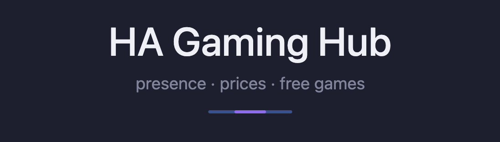
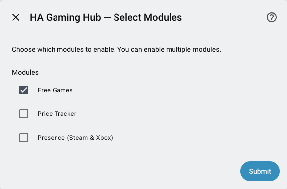
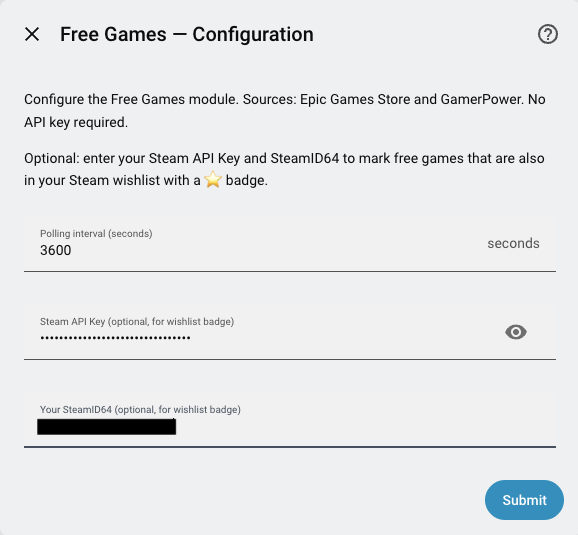
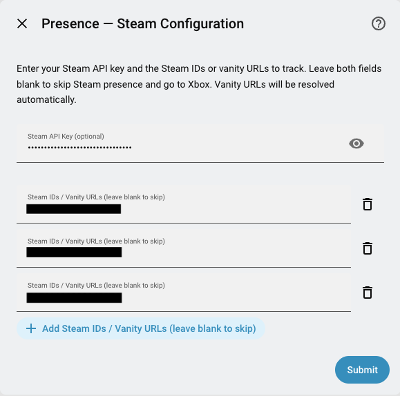

# HA Gaming Hub



A HACS custom integration for Home Assistant that brings gaming data into your smart home.

[](https://github.com/hacs/integration)
[](LICENSE)
[](https://github.com/nuggetz/ha-gaming-hub/releases)
[](https://github.com/nuggetz/ha-gaming-hub/issues)
[](https://github.com/nuggetz/ha-gaming-hub/commits/main)

---

## Modules

| Module | Description | API Key Required |
| ------ | ----------- | ---------------- |
| **Free Games** | Tracks free game promotions from Epic Games Store and GamerPower | No |
| **Price Tracker** | Monitors game prices and deals via CheapShark / IsThereAnyDeal | Optional (ITAD) |
| **Presence** | Shows Steam, Xbox and PlayStation Network online status for tracked accounts | Yes (Steam) / No (Xbox, PSN) |

You can enable any combination of modules during setup. Each module is independent.

---

## Installation

1. Make sure [HACS](https://hacs.xyz) is installed in your Home Assistant instance.
2. In HACS, go to **Integrations** and search for **HA Gaming Hub**.
3. Click **Download** and install it.
4. Restart Home Assistant.
5. Go to **Settings → Integrations → Add Integration** and search for **HA Gaming Hub**.
6. Follow the setup wizard to select and configure your modules.

> **Tip:** you can change any setting (modules, API keys, Steam IDs, Xbox accounts) at any time via **Settings → Integrations → HA Gaming Hub → ⋮ → Reconfigure**.

### Setup screenshots

| Module selection | Free Games config | Presence / Steam config |
| ---------------- | ----------------- | ----------------------- |
|  |  |  |

---

## The Unified Deals Sensor

Regardless of which modules you enable, the integration creates a single sensor that combines everything:

**`sensor.gaming_hub_deals`**

| What it shows | Source |
| ------------- | ------ |
| Free games (100% off) | Epic Games Store + GamerPower |
| Watchlist deals | Your Price Tracker watchlist (ITAD / CheapShark) |

State = total item count. The `on_sale` attribute contains every entry in **Nintendo Wishlist Card** format.

Any game that is also in your **Steam wishlist** gets a ⭐ prefix in its `sale_price` field — across both free games and tracked deals — so you never miss a game you actually want.

### Dashboard card

```yaml
type: custom:nintendo-wishlist-card
entity: sensor.gaming_hub_deals
title: Gaming Hub
```

### ⭐ Steam Wishlist Matching

The ⭐ badge is automatic if you:

1. Have the [steam_wishlist](https://github.com/custom-components/steam_wishlist) custom integration installed and configured in HA (the integration already polls your wishlist periodically)
2. Enter your **SteamID64** during HA Gaming Hub setup (Free Games or Price Tracker step)

The integration reads game titles directly from the `steam_wishlist` entities already in your HA, so no extra API calls are needed. If `steam_wishlist` is not installed, it falls back to the Steam Web API (requires a Steam API key).

**Finding your SteamID64:**

- Custom URL (`steamcommunity.com/id/yourname`) → use [steamid.io](https://steamid.io) to convert to the 17-digit numeric ID
- Numeric URL (`steamcommunity.com/profiles/76561198XXXXXXXXX`) → the number in the URL is your SteamID64

---

## Free Games Module

### Entities

| Entity | Type | Description |
| ------ | ---- | ----------- |
| `sensor.gaming_hub_free_games_count` | Sensor | Number of currently available free games |
| `sensor.gaming_hub_free_games_value` | Sensor | Total value of current free games (USD) |
| `calendar.gaming_hub_free_games` | Calendar | All free games as calendar events with claim deadlines |
| `binary_sensor.gaming_hub_free_game_expiring_soon` | Binary Sensor | `on` when a free game expires within 24 h. Attributes: `title`, `store`, `url`, `expires_in_hours` |

> **Note — entity IDs:** if your entities show up as `sensor.free_games_available`, HA has cached old IDs. Go to **Settings → Entities**, search for "free games", delete the old entries, then reload the integration.

### Data sources

- **Epic Games Store** — official free game promotions (current + upcoming), with cover art
- **GamerPower** — aggregator for PC giveaways across Steam, GOG, Itch.io, and more (Epic excluded to avoid duplicates)

### Dashboard cards

`sensor.gaming_hub_free_games_count` exposes two attributes: `data` (Upcoming Media Card) and `on_sale` (Nintendo Wishlist Card).

#### Nintendo Wishlist Card

```yaml
type: custom:nintendo-wishlist-card
entity: sensor.gaming_hub_free_games_count
title: Free Games
```

#### Upcoming Media Card

```yaml
type: custom:upcoming-media-card
entity: sensor.gaming_hub_free_games_count
title: Free Games
max: 10
```

#### Markdown Card (no extra dependencies)

```yaml
type: markdown
title: 🎮 Free Games
content: >
  
  
  
  **{{ g.title }}** — {{ g.sale_price }}
  ~~{{ g.normal_price }}~~

  ---
  
```

### Attribute reference

#### `on_sale` — Nintendo Wishlist Card format

| Field | Description |
| ----- | ----------- |
| `title` | Game title |
| `box_art_url` | Cover art URL |
| `backgroundart` | Wide art URL |
| `sale_price` | `"Free · Steam"` / `"Free · Epic Games"` etc. Prefixed with ⭐ when the game is in your Steam wishlist |
| `normal_price` | Original value (`"$X.XX"`) if known from GamerPower, otherwise empty |
| `percent_off` | Always `100` |

#### `data` — Upcoming Media Card format

`data[0]` is the header row. Games start at `data[1:]`.

| Field | Description |
| ----- | ----------- |
| `title` | Game title |
| `rating` | Platform (e.g. `Epic Games`, `PC, Steam`) |
| `price` | `"FREE"` or `"FREE ($X.XX value)"`. Prefixed with ⭐ when in Steam wishlist |
| `release` | Human-readable expiry, e.g. `Expires 30 Apr 2026` |
| `genres` | Content type: `game`, `dlc`, `loot`, `other` |
| `airdate` | Expiry date as `YYYY-MM-DD` (or `unknown`) |
| `box_art_url` | Wide cover art URL |
| `poster` | Portrait cover art (falls back to wide) |
| `deep_link` | Direct URL to the store / claim page |

### Configuration options

During setup, after selecting Free Games:

| Field | Default | Notes |
| ----- | ------- | ----- |
| Polling interval | 1 800 s (30 min) | Min 30 min, max 24 h |
| Steam API Key | *(empty)* | Optional — only needed if `steam_wishlist` integration is not installed |
| SteamID64 | *(empty)* | Optional — required for ⭐ wishlist matching; pre-fills the same field in Price Tracker |

---

## Price Tracker Module

Monitors the price of games you add to a watchlist. For each tracked game the integration creates a set of entities that update automatically and can trigger automations when a deal is found.

### Price data sources

- **CheapShark** — aggregates deals from 30+ stores (Steam, GOG, Humble, Fanatical, GreenManGaming, and more). No API key required.
- **IsThereAnyDeal (ITAD)** — optional enrichment: historical lows, more stores, richer metadata. Requires a free API key.

### Getting an ITAD API key (optional)

1. Create a free account at [IsThereAnyDeal.com](https://isthereanydeal.com)
2. Go to your [Developer page](https://isthereanydeal.com/dev/app/) (top-right menu → Developer)
3. Create a new application — any name (e.g. `Home Assistant`)
4. Copy the **API key** shown in the application details

You can leave this field blank: the integration will use CheapShark-only data, which is sufficient for price and discount tracking.

### Managing your watchlist

**From the UI:** go to **Settings → Integrations → HA Gaming Hub → Configure**:

- Type a game title in **Add game** and submit → a search step shows matching results, pick the correct one
- Select a game in **Remove game** and submit → the game and all its entities are deleted immediately

**From automations or scripts:** use the built-in services (see [Services](#services) below).

### Entities (per tracked game)

Entity IDs use a slugified version of the game title (e.g. `cyberpunk_2077`).

| Entity | Type | Description |
| ------ | ---- | ----------- |
| `sensor.gaming_hub_<slug>_best_price` | Sensor | Current lowest price across all stores (USD) |
| `sensor.gaming_hub_<slug>_best_store` | Sensor | Store offering the best current price |
| `sensor.gaming_hub_<slug>_discount` | Sensor | Current discount percentage (0–100) |
| `sensor.gaming_hub_<slug>_score` | Sensor | Metacritic score (0–100). **Requires ITAD API key.** OpenCritic score available as attribute when present. Shows `unknown` without a key or if the game has no review data. Attributes: `metacritic_url`, `opencritic_score`, `opencritic_url` |
| `sensor.gaming_hub_<slug>_cost_per_hour` | Sensor | Current best price ÷ main story hours from HowLongToBeat (USD/h). Shows `unknown` if HLTB has no data for the game. Attributes: `hours_main`, `hours_extra`, `hours_completionist` |
| `binary_sensor.gaming_hub_<slug>_on_sale` | Binary Sensor | `on` when any store has a discount > 0% |
| `binary_sensor.gaming_hub_<slug>_historical_low` | Binary Sensor | `on` when the current best price equals the all-time low |

The `sensor.gaming_hub_<slug>_best_price` entity also exposes:

| Attribute | Description |
| --------- | ----------- |
| `cheapest_ever_price` | All-time lowest price recorded (USD) |
| `cheapest_ever_date` | Date of the all-time low |
| `in_steam_wishlist` | `true` if the game is in your Steam wishlist |

### Aggregate sensor

`sensor.gaming_hub_price_tracker_deals` aggregates your entire watchlist in Nintendo Wishlist Card format. State = number of games currently on sale. The `on_sale` attribute lists all tracked games with price, store, discount, cover art, and ⭐ where applicable.

```yaml
type: custom:nintendo-wishlist-card
entity: sensor.gaming_hub_price_tracker_deals
title: Price Tracker
```

```yaml
type: markdown
title: 🎮 Price Tracker
content: |
  
  
  
  **{{ g.title }}** — {{ g.sale_price }}
   ~~{{ g.normal_price }}~~ (-{{ g.percent_off }}%)

  ---
  
```

### Deals Calendar

`calendar.gaming_hub_deals` shows all watchlist games that have a known deal expiry date as calendar events. Event title includes the discounted price and discount percentage; description marks all-time lows. Requires ITAD API key (expiry data comes from ITAD).

### What requires an ITAD API key

| Feature | Without key | With key |
| ------- | ----------- | -------- |
| Price & discount tracking | ✅ CheapShark (30+ stores) | ✅ + more stores |
| `score` sensor | ❌ always `unknown` | ✅ Metacritic/OpenCritic |
| `historical_low` binary sensor | ✅ via CheapShark | ✅ via ITAD |
| `calendar.gaming_hub_deals` | ❌ always empty | ✅ Flash Sales with expiry |

> Games available through subscription services (Xbox Game Pass, EA Play, etc.) are excluded from price tracking — the sensor shows `unknown` rather than `$0.00`.

### Price Tracker configuration options

| Field | Default | Notes |
| ----- | ------- | ----- |
| ITAD API Key | *(empty)* | Optional — see table above |
| Polling interval | 3 600 s (1 h) | Min 1 h, max 24 h |
| Steam API Key | *(empty)* | Pre-filled if entered in Free Games step |
| SteamID64 | *(empty)* | Pre-filled if entered in Free Games step |

### Example automation

```yaml
alias: Notify when a wishlisted game hits all-time low
trigger:
  - platform: state
    entity_id: binary_sensor.gaming_hub_cyberpunk_2077_historical_low
    to: "on"
action:
  - service: notify.mobile_app_your_phone
    data:
      title: "Deal alert!"
      message: >
        Cyberpunk 2077 is at its all-time low:
        ${{ states('sensor.gaming_hub_cyberpunk_2077_best_price') }}
        on {{ states('sensor.gaming_hub_cyberpunk_2077_best_store') }}
```

---

## Services

HA Gaming Hub registers two services you can call from **Developer Tools → Services**, automations, or scripts.

### `ha_gaming_hub.add_to_watchlist`

Searches for a game by title and adds it to the Price Tracker watchlist automatically. Requires the Price Tracker module to be enabled.

| Field | Required | Description |
| ----- | -------- | ----------- |
| `title` | Yes | Game title to search for (e.g. `"Cyberpunk 2077"`) |

```yaml
action:
  - service: ha_gaming_hub.add_to_watchlist
    data:
      title: "Cyberpunk 2077"
```

### `ha_gaming_hub.remove_from_watchlist`

Removes a game from the watchlist by its slug. The slug is the hyphenated lowercase title (e.g. `cyberpunk-2077`). You can find it in the entity_id of any sensor for that game — HA converts hyphens to underscores, so `cyberpunk-2077` appears as `sensor.gaming_hub_cyberpunk_2077_best_price`.

| Field | Required | Description |
| ----- | -------- | ----------- |
| `slug` | Yes | Game slug (e.g. `"cyberpunk-2077"`) |

```yaml
action:
  - service: ha_gaming_hub.remove_from_watchlist
    data:
      slug: "cyberpunk-2077"
```

---

## Presence Module

Shows the online and gaming status of Steam, Xbox and PlayStation Network accounts in real time.

### Steam setup (optional)

Steam tracking is optional. Leave both Steam fields blank to skip it and go straight to the Xbox step.

#### 1 — Get a Steam API key

1. Go to [https://steamcommunity.com/dev/apikey](https://steamcommunity.com/dev/apikey) (must be logged in)
2. Enter any domain (e.g. `homeassistant.local`) and click **Register**
3. Copy the key shown on the next page

> **Tip:** if you entered a Steam API key in the Free Games or Price Tracker step, it will be pre-filled here automatically.

#### 2 — Find Steam IDs or Vanity URLs

- **Custom URL** (`steamcommunity.com/id/yourname`) → enter `yourname` as the Vanity URL
- **Numeric URL** (`steamcommunity.com/profiles/76561198XXXXXXXXX`) → enter the 17-digit number

You can track multiple accounts: one ID or Vanity URL per line. Vanity URLs are resolved to SteamID64 automatically during setup.

### Xbox setup

Xbox support reads data from the **official Home Assistant Xbox integration** — no extra credentials needed on your side.

#### Step 1 — Install the native Xbox integration

1. **Settings → Integrations → Add Integration → Xbox**
2. Complete the OAuth flow (requires Nabu Casa or externally accessible HA)
3. The integration creates `binary_sensor.<gamertag>` entities automatically (e.g. `binary_sensor.vesta92`)

#### Step 2 — Link in HA Gaming Hub

During Presence setup, after the Steam step, detected Xbox accounts are listed for selection. If the Xbox integration is not installed, this step is skipped automatically.

### PlayStation Network (PSN) setup

PSN support reads data from the **official Home Assistant PlayStation Network integration** — no extra credentials needed.

#### Step 1 — Install the native PSN integration

1. **Settings → Integrations → Add Integration → PlayStation Network**
2. Complete the OAuth flow
3. The integration creates `sensor.<username>_online_status` and `sensor.<username>_now_playing` entities automatically

#### Step 2 — Link PSN in HA Gaming Hub

During Presence setup, after the Xbox step, detected PSN accounts are listed for selection. If the PSN integration is not installed, this step is skipped automatically.

### Presence entities

Entity IDs follow a platform-prefixed pattern: `steam_`, `xbox_`, or `psn_` followed by the account identifier.

#### Per Steam account

| Entity | Type | Description |
| ------ | ---- | ----------- |
| `binary_sensor.gaming_hub_steam_<steamid>_online` | Binary Sensor | `on` when online (any state except Offline) |
| `sensor.gaming_hub_steam_<steamid>_playing` | Sensor | Current game, or `None` if idle |
| `sensor.gaming_hub_steam_<steamid>_hours_recent` | Sensor | Hours played in the last 2 weeks |
| `sensor.gaming_hub_steam_<steamid>_session_duration` | Sensor | Minutes in the current play session. `None` when not playing. Attributes: `game`, `started_at` |

#### Per Xbox account

| Entity | Type | Description |
| ------ | ---- | ----------- |
| `binary_sensor.gaming_hub_xbox_<gamertag>_online` | Binary Sensor | `on` when active on Xbox Live |
| `sensor.gaming_hub_xbox_<gamertag>_playing` | Sensor | Current game or activity, or `None` if idle |
| `sensor.gaming_hub_xbox_<gamertag>_session_duration` | Sensor | Minutes in the current play session. `None` when not playing. Attributes: `game`, `started_at` |

#### Per PSN account

| Entity | Type | Description |
| ------ | ---- | ----------- |
| `binary_sensor.gaming_hub_psn_<username>_online` | Binary Sensor | `on` when online (any status other than offline) |
| `sensor.gaming_hub_psn_<username>_playing` | Sensor | Current game, or `None` if idle |
| `sensor.gaming_hub_psn_<username>_session_duration` | Sensor | Minutes in the current play session. `None` when not playing. Attributes: `game`, `started_at` |

#### Aggregate

| Entity | Type | Description |
| ------ | ---- | ----------- |
| `binary_sensor.gaming_hub_someone_is_gaming` | Binary Sensor | `on` when **any** tracked account (Steam, Xbox or PSN) is actively playing |

### Example automation — scene trigger

```yaml
# Turn on a light scene when someone starts gaming
alias: Gaming light on
trigger:
  - platform: state
    entity_id: binary_sensor.gaming_hub_someone_is_gaming
    to: "on"
action:
  - service: hue.activate_scene
    data:
      group_name: Living Room
      scene_name: Gaming
```

---

## Events & Automations

The integration fires HA events whenever something notable changes. Use them as automation triggers — no polling needed.

| Event | When fired | Key data |
| ----- | ---------- | -------- |
| `ha_gaming_hub_free_game_added` | A new free game appears | `title`, `store`, `end_date`, `url`, `in_steam_wishlist` |
| `ha_gaming_hub_deal_found` | A tracked game goes on sale | `title`, `best_price`, `best_store`, `discount_pct`, `in_steam_wishlist` |
| `ha_gaming_hub_historical_low` | A tracked game hits its all-time low price | `title`, `best_price`, `best_store`, `in_steam_wishlist` |
| `ha_gaming_hub_friend_online` | A Steam, Xbox or PSN friend comes online | `platform`, `name`, `playing` |
| `ha_gaming_hub_session_started` | An account starts playing a game | `platform`, `name`, `game` |
| `ha_gaming_hub_session_ended` | An account stops playing | `platform`, `name`, `game`, `duration_minutes` |

Events are **not** fired on the first HA startup — only on subsequent changes. Session duration resets on HA restart.

### Example: notify on new wishlist deal

```yaml
alias: Notify wishlist game on sale
trigger:
  - platform: event
    event_type: ha_gaming_hub_deal_found
    event_data:
      in_steam_wishlist: true
action:
  - service: notify.mobile_app_your_phone
    data:
      title: "⭐ Wishlist deal!"
      message: >
        {{ trigger.event.data.title }} is
        {{ trigger.event.data.discount_pct }}% off on
        {{ trigger.event.data.best_store }}
        (${{ trigger.event.data.best_price }})
```

### Example: notify on all-time low

```yaml
alias: Notify historical low
trigger:
  - platform: event
    event_type: ha_gaming_hub_historical_low
action:
  - service: notify.mobile_app_your_phone
    data:
      title: "📉 All-time low!"
      message: >
        {{ trigger.event.data.title }} is at its all-time low:
        ${{ trigger.event.data.best_price }}
        on {{ trigger.event.data.best_store }}
```

### Example: notify when a friend comes online

```yaml
alias: Friend online
trigger:
  - platform: event
    event_type: ha_gaming_hub_friend_online
action:
  - service: notify.mobile_app_your_phone
    data:
      title: "🎮 {{ trigger.event.data.name }} is online"
      message: >
        
        Playing: {{ trigger.event.data.playing }}
        
        Online on {{ trigger.event.data.platform }}
        
```

### Example: notify on gaming session end

```yaml
alias: Session ended
trigger:
  - platform: event
    event_type: ha_gaming_hub_session_ended
action:
  - service: notify.mobile_app_your_phone
    data:
      title: "{{ trigger.event.data.name }} finished gaming"
      message: >
        Played {{ trigger.event.data.game }}
        for {{ trigger.event.data.duration_minutes }} minutes.
```

---

## Helper Sensors

| Entity | Module required | Description |
| ------ | --------------- | ----------- |
| `sensor.gaming_hub_next_free_game_expiry` | Free Games | Timestamp of the next free game expiry. HA displays it as "in X hours". Attributes: `title`, `store`, `url` of the soonest-expiring game. |
| `sensor.gaming_hub_wishlist_games_on_sale` | Price Tracker | Count of watchlist games that are **both** in your Steam wishlist and currently on sale. The `on_sale` attribute lists them in Nintendo Wishlist Card format. |

### Dashboard card — wishlist deals only

```yaml
type: custom:nintendo-wishlist-card
entity: sensor.gaming_hub_wishlist_games_on_sale
title: Wishlist On Sale
```

---

## Automation Blueprints

> **Coming soon.** Importable blueprints for the most common use cases:
>
> - **New free game alert** — notify when a new game is available for free
> - **Wishlist deal alert** — notify when a wishlisted game goes on sale
> - **Historical low alert** — notify when a tracked game hits its all-time low
> - **Friend online** — trigger a scene or notify when a friend comes online on Steam, Xbox or PSN
> - **Session ended** — log or notify when a gaming session ends with duration

---

## Development Status

| Milestone | Description | Status |
| --------- | ----------- | ------ |
| 0 | Setup & Infrastructure | ✅ Done |
| 1 | Free Games module | ✅ Done |
| 2 | Price Tracker module | ✅ Done |
| 3 | Presence module (Steam + Xbox) | ✅ Done |
| 4 | Events, helper sensors & reconfigure | ✅ Done |
| 5 | PSN presence, score/cost-per-hour sensors, services, deals calendar, session tracking | ✅ Done |
